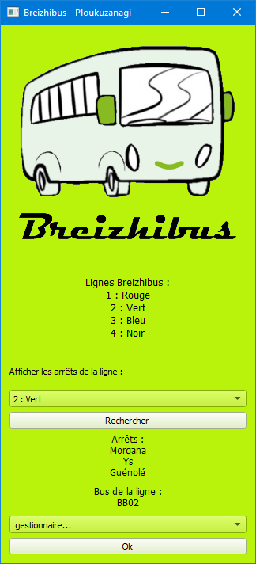

# P02_breizhibus

## Le fonctionnement de l'appli

L'interface comporte 3 fenêtres.

Dans la première interface, un bouton permet l'affichage des arrêts et des bus d'une ligne choisie dans sune combo-box. Le résultat s'affiche directement dans la  fenêtre. 
En bas de la fenêtre, une combo-box suivie d'un autre bonton permettent de choisir une autre action à exécuter : ajouter, ou modifier/supprimer un bus. L'appui sur le bonton affiche la fenêtre correspondante.
 

La fenêtre ajout comporte les champs nécessaires pour entrer un nouveau bus en base. Tous les champs sont oligatoires et une popup d'erreur s'affiche si l'utilisateur omet un champ.

La dernière fenetre comporte deux volets, l'un permettant la modification du bus choisi dna sle menu déroulant commun, l'autre sa suppression. 

## choix techniques

Le code python se compose de 6 fichiers :
- Un fichier ["main"](main.py) de quelques lignes qui sert à lancer l'appli,
- Un fichier ["fenêtre principale"](fenetre_principale.py), qui contient la classe _Fenetre_ et permet d'afficher, lors de l'appel par le main, une instance de cette classe.
- deux fichiers ["fenêtre ajout"](fenetre_ajout.py) et ["fenêtre modif"](fenetre_modif.py) qui contiennent deux classes du même nom qui permettent d'afficher, lorsqu'elles sont appelées par la classe _Fenetre_, respectivement une fenêtre qui permet d'ajouter et une qui permet de modifier/supprimer un bus.
- Un fichier ["bdd"](bdd.py) qui crée la connexion avec la base de données mysql et contient diverses méthodes applicables pour requérir les données.
- Un fichier ["popup"](popup.py) qui contient une classe du même nom et permet l'affichage de fenêtre popup dans divers cas d'erreurs (dont l'affichage est géré dnas le code par la gestion des excepions _try/except_)

Les principaux modules pythons utilisés sont :
* `mysql.connector`, qui permet  de créer la connexion avec la base de données,
* `pyqt5`, pour la création de toute l'interface graphique.

## difficultés rencontrées 

J'ai réalisé ma première inteface graphique pour ce projet. J'ai choisi d'utiliser PyQt pour cela et j'ai donc passé un certain temps à suivre de nombreux tutoriels.  
quelques références :
* [Tech With Tim - Playlist PyQt5](https://www.youtube.com/playlist?list=PLzMcBGfZo4-lB8MZfHPLTEHO9zJDDLpYj)
* [courspython.com - Interfaces graphiques](https://courspython.com/interfaces.html)

Pour l'interface principale, réalisée au tout début du projet, j'ai choisi un présentation stackée verticalement. Ce n'est probablement pas le choix que je ferais si je devais refaire ce brief, mais c'est fonctionnel. J'ai beaucoup appris sur les interfaces graphiques lors de ce projet.

